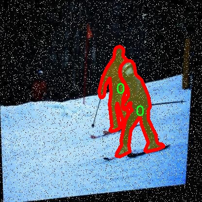

# 儿童检测图像分割系统： yolov8-seg-dyhead

### 1.研究背景与意义

[参考博客](https://gitee.com/YOLOv8_YOLOv11_Segmentation_Studio/projects)

[博客来源](https://kdocs.cn/l/cszuIiCKVNis)

研究背景与意义

随着社会的发展和科技的进步，儿童安全问题日益受到重视。儿童在日常生活中面临着诸多潜在的危险，包括交通事故、走失、以及其他安全隐患。因此，如何有效地监测和保护儿童，成为了一个亟待解决的社会问题。近年来，计算机视觉技术的快速发展为儿童安全监测提供了新的解决方案。特别是目标检测与图像分割技术的进步，使得我们能够更精确地识别和定位图像中的儿童对象，从而为安全管理提供有力支持。

YOLO（You Only Look Once）系列模型因其高效的实时目标检测能力而广受欢迎。YOLOv8作为该系列的最新版本，结合了深度学习的先进技术，具备了更高的检测精度和速度。然而，针对儿童的检测与分割任务，YOLOv8在处理特定场景和对象时仍存在一定的局限性。因此，基于YOLOv8的改进，构建一个专门针对儿童检测的图像分割系统，具有重要的理论价值和实际意义。

本研究将利用一个包含1100张图像的数据集，该数据集专注于儿童检测，涵盖了三类目标对象。这些图像不仅数量充足，而且多样性强，能够有效支持模型的训练与验证。通过对这些图像进行实例分割，研究者可以更准确地识别和分离图像中的儿童对象，从而提高检测的精度和可靠性。尤其是在复杂背景和不同光照条件下，改进后的YOLOv8模型能够更好地适应多变的环境，提升儿童检测的鲁棒性。

此外，儿童检测图像分割系统的研究不仅限于技术层面，其社会意义同样不可忽视。通过实时监测和分析儿童的活动，家长和监护人能够更好地掌握儿童的安全状况，及时采取必要的保护措施。同时，该系统还可以为公共场所的安全管理提供数据支持，帮助相关部门制定更有效的安全防范策略。随着智能监控技术的普及，基于图像分割的儿童检测系统将成为儿童安全管理的重要工具。

总之，基于改进YOLOv8的儿童检测图像分割系统的研究，既是对现有计算机视觉技术的深化应用，也是对儿童安全问题的积极回应。通过提升儿童检测的准确性和实时性，本研究不仅为学术界提供了新的研究思路，也为社会的儿童安全保障贡献了技术力量。未来，随着研究的深入和技术的不断完善，该系统有望在更多实际场景中得到应用，为儿童的安全保驾护航。

### 2.图片演示


注意：本项目提供完整的训练源码数据集和训练教程,由于此博客编辑较早,暂不提供权重文件（best.pt）,需要按照6.训练教程进行训练后实现上图效果。

### 3.视频演示

[3.1 视频演示](https://www.bilibili.com/video/BV1P9UAY5EDg/)

### 4.数据集信息

##### 4.1 数据集类别数＆类别名

nc: 3
names: ['0', '1', 'object']


##### 4.2 数据集信息简介

数据集信息展示

在本研究中，我们采用了名为“kids detection”的数据集，以训练和改进YOLOv8-seg模型，旨在提升儿童检测图像分割系统的性能。该数据集专门针对儿童的图像分割任务而设计，包含了多样化的场景和丰富的标注信息，为模型的训练提供了坚实的基础。数据集的类别数量为三，具体类别包括“0”、“1”和“object”，这些类别代表了不同的儿童检测目标，涵盖了从个体儿童到儿童相关物体的多种情况。

“kids detection”数据集的构建考虑到了儿童在不同环境中的多样性，数据集中包含了多种场景，如公园、学校、家庭等，这些场景不仅展示了儿童的日常活动，还体现了不同光照条件和背景的变化。这种多样性确保了模型在实际应用中的鲁棒性，使其能够在不同的环境中准确识别和分割儿童。数据集中的图像经过精心挑选和标注，确保每个类别的样本数量均衡，避免了模型训练过程中的偏差。

在标注方面，数据集采用了高精度的分割标注技术，确保每个儿童的轮廓清晰可辨。这种精细的标注方式使得YOLOv8-seg模型能够更好地学习到儿童的特征，从而在图像分割任务中实现更高的准确率。通过对每个类别的细致标注，模型能够在训练过程中捕捉到儿童的不同姿态、表情以及与周围环境的互动，进一步提升了模型的学习效果。

此外，数据集还考虑到了儿童的多样性，包括不同年龄段、性别和种族的儿童样本。这种多样性不仅有助于模型在不同人群中的泛化能力，也使得最终的检测系统能够更公平地对待所有儿童，避免了因样本偏差导致的识别不公。通过引入丰富的样本，数据集为模型提供了更全面的学习素材，使其能够在面对现实世界中的复杂情况时，依然保持高效的检测能力。

在数据集的使用过程中，我们还对图像进行了数据增强处理，包括旋转、缩放、裁剪等操作，以进一步扩展训练样本的多样性。这些增强技术不仅提高了模型的鲁棒性，还帮助模型更好地适应不同的输入条件，从而在实际应用中实现更高的准确性和可靠性。

总之，“kids detection”数据集为本研究提供了丰富的训练素材和高质量的标注信息，使得YOLOv8-seg模型在儿童检测图像分割任务中得以充分发挥其潜力。通过对该数据集的深入分析和应用，我们期望能够实现更为精准的儿童检测，推动相关技术的发展，并为儿童安全监护等实际应用提供有力支持。





### 5.项目依赖环境部署教程（零基础手把手教学）

[5.1 环境部署教程链接（零基础手把手教学）](https://www.bilibili.com/video/BV1jG4Ve4E9t/?vd_source=bc9aec86d164b67a7004b996143742dc)


[5.2 安装Python虚拟环境创建和依赖库安装视频教程链接（零基础手把手教学）](https://www.bilibili.com/video/BV1nA4VeYEze/?vd_source=bc9aec86d164b67a7004b996143742dc)

### 6.手把手YOLOV8-seg训练视频教程（零基础手把手教学）

[6.1 手把手YOLOV8-seg训练视频教程（零基础小白有手就能学会）](https://www.bilibili.com/video/BV1cA4VeYETe/?vd_source=bc9aec86d164b67a7004b996143742dc)


按照上面的训练视频教程链接加载项目提供的数据集，运行train.py即可开始训练



     Epoch   gpu_mem       box       obj       cls    labels  img_size
     1/200     0G   0.01576   0.01955  0.007536        22      1280: 100%|██████████| 849/849 [14:42<00:00,  1.04s/it]
               Class     Images     Labels          P          R     mAP@.5 mAP@.5:.95: 100%|██████████| 213/213 [01:14<00:00,  2.87it/s]
                 all       3395      17314      0.994      0.957      0.0957      0.0843

     Epoch   gpu_mem       box       obj       cls    labels  img_size
     2/200     0G   0.01578   0.01923  0.007006        22      1280: 100%|██████████| 849/849 [14:44<00:00,  1.04s/it]
               Class     Images     Labels          P          R     mAP@.5 mAP@.5:.95: 100%|██████████| 213/213 [01:12<00:00,  2.95it/s]
                 all       3395      17314      0.996      0.956      0.0957      0.0845

     Epoch   gpu_mem       box       obj       cls    labels  img_size
     3/200     0G   0.01561    0.0191  0.006895        27      1280: 100%|██████████| 849/849 [10:56<00:00,  1.29it/s]
               Class     Images     Labels          P          R     mAP@.5 mAP@.5:.95: 100%|███████   | 187/213 [00:52<00:00,  4.04it/s]
                 all       3395      17314      0.996      0.957      0.0957      0.0845


### 7.50+种全套YOLOV8-seg创新点加载调参实验视频教程（一键加载写好的改进模型的配置文件）

[7.1 50+种全套YOLOV8-seg创新点加载调参实验视频教程（一键加载写好的改进模型的配置文件）](https://www.bilibili.com/video/BV1Hw4VePEXv/?vd_source=bc9aec86d164b67a7004b996143742dc)

### YOLOV8-seg算法简介

原始YOLOv8-seg算法原理

YOLOv8-seg算法是YOLO系列目标检测模型的最新进展，专注于实现高效的目标检测与图像分割任务。作为YOLOv8的一个重要扩展，YOLOv8-seg不仅继承了YOLOv8在目标检测方面的优势，还在此基础上引入了图像分割的能力，使其能够在更复杂的场景中进行细粒度的目标识别和分割。该算法的设计理念旨在提高模型的准确性、速度和灵活性，以适应多种应用场景。

YOLOv8-seg的网络结构依然遵循YOLO系列的基本框架，主要由三个部分组成：Backbone、Neck和Head。Backbone负责特征提取，Neck用于特征融合，而Head则负责最终的目标检测和分割结果的生成。YOLOv8-seg在Backbone部分采用了CSPDarknet结构，这种结构通过分支和残差块的组合，能够有效提取多层次的特征信息。相较于前代模型，YOLOv8-seg引入了C2f模块，这一模块通过将输入特征图分为两个分支进行处理，能够在保持模型轻量化的同时，增强特征图的表达能力。每个分支经过卷积层的处理后，最终将特征图进行融合，从而提升了模型的梯度流信息，使得模型在训练过程中能够更好地捕捉到目标的细节。

在Neck部分，YOLOv8-seg采用了快速空间金字塔池化（SPPF）结构，这一设计使得模型能够有效提取不同尺度的特征，从而提高对多尺度目标的检测能力。通过特征金字塔网络（FPN）和路径聚合网络（PAN）的结合，YOLOv8-seg能够在不同层次上对特征进行有效的融合和压缩，进一步提升了模型的性能。

YOLOv8-seg的Head部分是其最大的创新之一。在这一部分，YOLOv8-seg摒弃了传统的Coupled-Head结构，转而采用Decoupled-Head结构。这一结构将目标检测和分割任务解耦，使得模型能够分别对目标的类别和位置进行预测。具体而言，YOLOv8-seg通过两个独立的卷积模块，分别对类别和边界框进行处理，从而提高了模型的预测精度。此外，YOLOv8-seg在损失函数的设计上也进行了优化，采用了分布焦点损失（DFL）和CIoU损失，这一组合能够使模型在训练过程中更快地聚焦于目标区域，提升了分割的准确性。

值得注意的是，YOLOv8-seg在目标检测中采用了无锚框（Anchor-Free）的方法，这一方法的引入使得模型在处理不同尺寸和形状的目标时更加灵活。传统的锚框方法虽然能够提高检测精度，但在面对多样化的目标时，往往需要对锚框进行复杂的调整和优化。而YOLOv8-seg通过将目标检测转化为关键点检测，避免了锚框的预设和计算，简化了模型的设计，提升了其泛化能力。

在输入处理方面，YOLOv8-seg支持自适应图像缩放，这一策略使得模型能够在处理不同长宽比的图像时，尽量减少信息的冗余。通过将图像的长边缩放到指定尺寸，并对短边进行填充，YOLOv8-seg能够在保持图像信息完整性的同时，提高目标检测和推理的速度。此外，YOLOv8-seg还引入了Mosaic图像增强技术，这一技术通过将多张图像拼接为一张新图像，迫使模型学习不同位置和周围像素的特征，从而提升了模型的鲁棒性和准确性。

总的来说，YOLOv8-seg算法在YOLOv8的基础上，结合了目标检测与图像分割的需求，通过改进的网络结构和创新的损失函数设计，显著提升了模型的性能。其无锚框的设计理念和灵活的输入处理方式，使得YOLOv8-seg在处理复杂场景时，能够实现更高的准确率和更快的推理速度。随着计算机视觉技术的不断发展，YOLOv8-seg无疑将成为目标检测和图像分割领域的重要工具，为各类应用提供强有力的支持。


### 9.系统功能展示（检测对象为举例，实际内容以本项目数据集为准）

图9.1.系统支持检测结果表格显示

  图9.2.系统支持置信度和IOU阈值手动调节

  图9.3.系统支持自定义加载权重文件best.pt(需要你通过步骤5中训练获得)

  图9.4.系统支持摄像头实时识别

  图9.5.系统支持图片识别

  图9.6.系统支持视频识别

  图9.7.系统支持识别结果文件自动保存

  图9.8.系统支持Excel导出检测结果数据


### 10.50+种全套YOLOV8-seg创新点原理讲解（非科班也可以轻松写刊发刊，V11版本正在科研待更新）

#### 10.1 由于篇幅限制，每个创新点的具体原理讲解就不一一展开，具体见下列网址中的创新点对应子项目的技术原理博客网址【Blog】：


[10.1 50+种全套YOLOV8-seg创新点原理讲解链接](https://gitee.com/qunmasj/good)

#### 10.2 部分改进模块原理讲解(完整的改进原理见上图和技术博客链接)【如果此小节的图加载失败可以通过CSDN或者Github搜索该博客的标题访问原始博客，原始博客图片显示正常】
### YOLOv8简介
YOLOv8 尚未发表论文，因此我们无法直接了解其创建过程中进行的直接研究方法和消融研究。话虽如此，我们分析了有关模型的存储库和可用信息，以开始记录 YOLOv8 中的新功能。

如果您想自己查看代码，请查看YOLOv8 存储库并查看此代码差异以了解一些研究是如何完成的。

在这里，我们提供了有影响力的模型更新的快速总结，然后我们将查看模型的评估，这不言自明。

GitHub 用户 RangeKing 制作的下图显示了网络架构的详细可视化。


在这里插入图片描述


在这里插入图片描述

YOLOv8 架构，GitHub 用户 RangeKing 制作的可视化

无锚检测
YOLOv8 是一个无锚模型。这意味着它直接预测对象的中心而不是已知锚框的偏移量。


YOLO中anchor box的可视化

锚框是早期 YOLO 模型中众所周知的棘手部分，因为它们可能代表目标基准框的分布，而不是自定义数据集的分布。


YOLOv8 的检测头，在netron.app中可视化

Anchor free 检测减少了框预测的数量，从而加速了非最大抑制 (NMS)，这是一个复杂的后处理步骤，在推理后筛选候选检测。


YOLOv8 的检测头，在netron.app中可视化

新的卷积
stem 的第一个6x6conv 被替换为 a 3x3，主要构建块被更改，并且C2f替换了C3。该模块总结如下图，其中“f”是特征数，“e”是扩展率，CBS是由a Conv、a BatchNorm、a组成的block SiLU。

在中， （两个具有剩余连接的 3x3C2f的奇特名称）的所有输出都被连接起来。而在仅使用最后一个输出。Bottleneck``convs``C3``Bottleneck


新的 YOLOv8C2f模块

这Bottleneck与 YOLOv5 中的相同，但第一个 conv 的内核大小从更改1x1为3x3. 从这些信息中，我们可以看到 YOLOv8 开始恢复到 2015 年定义的 ResNet 块。

在颈部，特征直接连接而不强制使用相同的通道尺寸。这减少了参数数量和张量的整体大小。

### 空间和通道重建卷积SCConv
参考该博客提出的一种高效的卷积模块，称为SCConv (spatial and channel reconstruction convolution)，以减少冗余计算并促进代表性特征的学习。提出的SCConv由空间重构单元(SRU)和信道重构单元(CRU)两个单元组成。

（1）SRU根据权重分离冗余特征并进行重构，以抑制空间维度上的冗余，增强特征的表征。

（2）CRU采用分裂变换和融合策略来减少信道维度的冗余以及计算成本和存储。

（3）SCConv是一种即插即用的架构单元，可直接用于替代各种卷积神经网络中的标准卷积。实验结果表明，scconvo嵌入模型能够通过减少冗余特征来获得更好的性能，并且显著降低了复杂度和计算成本。


SCConv如图所示，它由两个单元组成，空间重建单元(SRU)和通道重建单元(CRU)，以顺序的方式放置。具体而言，对于瓶颈残差块中的中间输入特征X，首先通过SRU运算获得空间细化特征Xw，然后利用CRU运算获得信道细化特征Y。SCConv模块充分利用了特征之间的空间冗余和通道冗余，可以无缝集成到任何CNN架构中，以减少中间特征映射之间的冗余并增强CNN的特征表示。

#### SRU单元用于空间冗余


为了利用特征的空间冗余，引入了空间重构单元(SRU)，如图2所示，它利用了分离和重构操作。

分离操作 的目的是将信息丰富的特征图与空间内容对应的信息较少的特征图分离开来。我们利用组归一化(GN)层中的比例因子来评估不同特征图的信息内容。具体来说，给定一个中间特征映射X∈R N×C×H×W，首先通过减去平均值µ并除以标准差σ来标准化输入特征X，如下所示:


其中µ和σ是X的均值和标准差，ε是为了除法稳定性而加入的一个小的正常数，γ和β是可训练的仿射变换。

GN层中的可训练参数\gamma \in R^{C}用于测量每个批次和通道的空间像素方差。更丰富的空间信息反映了空间像素的更多变化，从而导致更大的γ。归一化相关权重W_{\gamma} \in R^{C}由下面公式2得到，表示不同特征映射的重要性。


然后将经Wγ重新加权的特征映射的权值通过sigmoid函数映射到(0,1)范围，并通过阈值进行门控。我们将阈值以上的权重设置为1，得到信息权重W1，将其设置为0，得到非信息权重W2(实验中阈值设置为0.5)。获取W的整个过程可以用公式表示。


最后将输入特征X分别乘以W1和W2，得到两个加权特征:信息量较大的特征X_{1}^{\omega }和信息量较小的特征X_{2}^{\omega }。这样就成功地将输入特征分为两部分:X_{1}^{\omega }具有信息量和表达性的空间内容，而X_{2}^{\omega }几乎没有信息，被认为是冗余的。

重构操作 将信息丰富的特征与信息较少的特征相加，生成信息更丰富的特征，从而节省空间空间。采用交叉重构运算，将加权后的两个不同的信息特征充分结合起来，加强它们之间的信息流。然后将交叉重构的特征X^{\omega1}和X^{\omega2}进行拼接，得到空间精细特征映射X^{\omega}。从后过程表示如下：


其中⊗是逐元素的乘法，⊕是逐元素的求和，∪是串联。将SRU应用于中间输入特征X后，不仅将信息特征与信息较少的特征分离，而且对其进行重构，增强代表性特征，抑制空间维度上的冗余特征。然而，空间精细特征映射X^{\omega}在通道维度上仍然是冗余的。

#### CRU单元用于通道冗余


分割 操作将输入的空间细化特征X^{\omega}分割成两个部分，一部分通道数是\alpha C，另一部分通道数是(1-\alpha) C，随后对两组特征的通道数使用1 * 1卷积核进行压缩，分别得到X_{up}和X_{low}。

转换 操作将输入的X_{up}作为“富特征提取”的输入，分别进行GWC和PWC，然后相加得到输出Y1，将输入X_{low}作为“富特征提取”的补充，进行PWC，得到的记过和原来的输入取并集得到Y2。

融合 操作使用简化的SKNet方法来自适应合并Y1和Y2。具体说是首先使用全局平均池化将全局空间信息和通道统计信息结合起来，得到经过池化的S1和S2。然后对S1和S2做Softmax得到特征权重向量\beta _{1}和\beta _{2}，最后使用特征权重向量得到输出Y = \beta _{1}*Y_{1} + \beta _{2}*Y_{2}，Y即为通道提炼的特征。


### 11.项目核心源码讲解（再也不用担心看不懂代码逻辑）

#### 11.1 ultralytics\nn\backbone\VanillaNet.py

以下是对给定代码的核心部分进行分析和注释，保留了最重要的功能和结构：

```python
import torch
import torch.nn as nn
import torch.nn.functional as F
from timm.layers import weight_init

# 定义激活函数类
class Activation(nn.ReLU):
    def __init__(self, dim, act_num=3, deploy=False):
        super(Activation, self).__init__()
        self.deploy = deploy  # 是否处于部署模式
        # 权重初始化
        self.weight = torch.nn.Parameter(torch.randn(dim, 1, act_num*2 + 1, act_num*2 + 1))
        self.bias = None
        self.bn = nn.BatchNorm2d(dim, eps=1e-6)  # 批归一化
        self.dim = dim
        self.act_num = act_num
        weight_init.trunc_normal_(self.weight, std=.02)  # 权重截断正态初始化

    def forward(self, x):
        # 前向传播
        if self.deploy:
            return F.conv2d(
                super(Activation, self).forward(x), 
                self.weight, self.bias, padding=(self.act_num*2 + 1)//2, groups=self.dim)
        else:
            return self.bn(F.conv2d(
                super(Activation, self).forward(x),
                self.weight, padding=self.act_num, groups=self.dim))

    def switch_to_deploy(self):
        # 切换到部署模式
        if not self.deploy:
            kernel, bias = self._fuse_bn_tensor(self.weight, self.bn)
            self.weight.data = kernel
            self.bias = torch.nn.Parameter(torch.zeros(self.dim))
            self.bias.data = bias
            self.__delattr__('bn')  # 删除bn属性
            self.deploy = True

# 定义基本块
class Block(nn.Module):
    def __init__(self, dim, dim_out, act_num=3, stride=2, deploy=False):
        super().__init__()
        self.deploy = deploy
        # 定义卷积层和激活函数
        if self.deploy:
            self.conv = nn.Conv2d(dim, dim_out, kernel_size=1)
        else:
            self.conv1 = nn.Sequential(
                nn.Conv2d(dim, dim, kernel_size=1),
                nn.BatchNorm2d(dim, eps=1e-6),
            )
            self.conv2 = nn.Sequential(
                nn.Conv2d(dim, dim_out, kernel_size=1),
                nn.BatchNorm2d(dim_out, eps=1e-6)
            )
        self.pool = nn.MaxPool2d(stride) if stride != 1 else nn.Identity()  # 池化层
        self.act = Activation(dim_out, act_num)  # 激活函数

    def forward(self, x):
        # 前向传播
        if self.deploy:
            x = self.conv(x)
        else:
            x = self.conv1(x)
            x = F.leaky_relu(x, negative_slope=1)  # 使用Leaky ReLU激活
            x = self.conv2(x)

        x = self.pool(x)  # 池化
        x = self.act(x)  # 激活
        return x

# 定义VanillaNet模型
class VanillaNet(nn.Module):
    def __init__(self, in_chans=3, num_classes=1000, dims=[96, 192, 384, 768], 
                 drop_rate=0, act_num=3, strides=[2,2,2,1], deploy=False):
        super().__init__()
        self.deploy = deploy
        # 定义输入层
        if self.deploy:
            self.stem = nn.Sequential(
                nn.Conv2d(in_chans, dims[0], kernel_size=4, stride=4),
                Activation(dims[0], act_num)
            )
        else:
            self.stem1 = nn.Sequential(
                nn.Conv2d(in_chans, dims[0], kernel_size=4, stride=4),
                nn.BatchNorm2d(dims[0], eps=1e-6),
            )
            self.stem2 = nn.Sequential(
                nn.Conv2d(dims[0], dims[0], kernel_size=1, stride=1),
                nn.BatchNorm2d(dims[0], eps=1e-6),
                Activation(dims[0], act_num)
            )

        self.stages = nn.ModuleList()  # 存储各个Block
        for i in range(len(strides)):
            stage = Block(dim=dims[i], dim_out=dims[i+1], act_num=act_num, stride=strides[i], deploy=deploy)
            self.stages.append(stage)

    def forward(self, x):
        # 前向传播
        if self.deploy:
            x = self.stem(x)
        else:
            x = self.stem1(x)
            x = F.leaky_relu(x, negative_slope=1)
            x = self.stem2(x)

        for stage in self.stages:
            x = stage(x)  # 逐层传递
        return x

# 定义模型构建函数
def vanillanet_10(pretrained='', **kwargs):
    model = VanillaNet(dims=[128*4, 128*4, 256*4, 512*4, 512*4, 512*4, 512*4, 1024*4, 1024*4], strides=[1,2,2,1,1,1,2,1], **kwargs)
    if pretrained:
        weights = torch.load(pretrained)['model_ema']
        model.load_state_dict(weights)  # 加载预训练权重
    return model

if __name__ == '__main__':
    inputs = torch.randn((1, 3, 640, 640))  # 随机输入
    model = vanillanet_10()  # 实例化模型
    pred = model(inputs)  # 进行预测
    for i in pred:
        print(i.size())  # 输出每层的尺寸
```

### 代码核心部分说明：
1. **Activation 类**：自定义的激活函数类，支持在训练和部署模式下的不同处理，包含了权重和偏置的初始化和前向传播逻辑。
2. **Block 类**：基本构建块，包含卷积层、池化层和激活函数，负责特征提取。
3. **VanillaNet 类**：整个网络的结构，包含输入层和多个 Block，支持前向传播和权重加载。
4. **vanillanet_10 函数**：用于构建特定结构的 VanillaNet 模型，并支持加载预训练权重。

以上是对代码的核心部分进行了提炼和详细注释，确保了代码的可读性和理解性。

该文件定义了一个名为 `VanillaNet` 的深度学习模型，主要用于计算机视觉任务。代码中使用了 PyTorch 框架，并包含了一些自定义的模块和功能。

首先，文件开头包含版权信息和许可证声明，说明该程序是开源的，可以在 MIT 许可证下使用。

接下来，导入了必要的库，包括 PyTorch 的核心模块和一些辅助函数。特别是，`timm.layers` 中的 `weight_init` 和 `DropPath` 被引入，用于权重初始化和可能的随机丢弃路径功能。

文件中定义了多个类和函数。`activation` 类是一个自定义的激活函数，继承自 ReLU。它包含一个可学习的权重参数和一个批归一化层。根据 `deploy` 参数的不同，该类在前向传播时会选择不同的计算路径。

`Block` 类表示网络中的一个基本模块，包含两个卷积层和一个激活层。根据 `deploy` 参数的设置，模块可以选择在训练或推理模式下运行。该模块还实现了一个融合批归一化的功能，以便在推理时减少计算量。

`VanillaNet` 类是整个网络的核心。它由多个 `Block` 组成，并且可以根据输入通道数、类别数和其他参数进行初始化。网络的前向传播过程会通过各个模块处理输入，并在特定的尺度下提取特征。

在 `VanillaNet` 的构造函数中，首先定义了一个输入层（stem），然后根据给定的步幅和维度构建多个阶段（stages）。每个阶段都是一个 `Block`，用于逐步提取特征。网络的权重初始化也在此处进行。

文件中还定义了一些辅助函数，例如 `update_weight`，用于更新模型的权重。接下来，定义了一系列函数（如 `vanillanet_5` 到 `vanillanet_13_x1_5_ada_pool`），这些函数用于创建不同配置的 `VanillaNet` 实例，并可以选择加载预训练权重。

最后，文件的主程序部分创建了一个随机输入，并实例化了 `vanillanet_10` 模型。然后，模型对输入进行前向传播，并打印出每个输出特征图的尺寸。

整体而言，该文件实现了一个灵活的卷积神经网络架构，支持多种配置和推理模式，适合用于图像分类等任务。

#### 11.2 ultralytics\data\dataset.py

以下是代码中最核心的部分，并附上详细的中文注释：

```python
import numpy as np
import torch
from pathlib import Path
from ultralytics.utils import TQDM, LOGGER, get_hash, img2label_paths, verify_image, verify_image_label

# Ultralytics 数据集缓存版本
DATASET_CACHE_VERSION = '1.0.3'

class YOLODataset:
    """
    YOLO 数据集类，用于加载 YOLO 格式的目标检测和/或分割标签。

    参数:
        data (dict, optional): 数据集的 YAML 字典。默认为 None。
        use_segments (bool, optional): 如果为 True，则使用分割掩码作为标签。默认为 False。
        use_keypoints (bool, optional): 如果为 True，则使用关键点作为标签。默认为 False。
    """

    def __init__(self, data=None, use_segments=False, use_keypoints=False):
        """初始化 YOLODataset，配置分割和关键点的选项。"""
        self.use_segments = use_segments
        self.use_keypoints = use_keypoints
        self.data = data
        assert not (self.use_segments and self.use_keypoints), '不能同时使用分割和关键点。'

    def cache_labels(self, path=Path('./labels.cache')):
        """
        缓存数据集标签，检查图像并读取形状。

        参数:
            path (Path): 缓存文件保存路径（默认: Path('./labels.cache')）。
        返回:
            (dict): 标签字典。
        """
        x = {'labels': []}
        nm, nf, ne, nc, msgs = 0, 0, 0, 0, []  # 统计缺失、找到、空、损坏的数量和消息
        total = len(self.im_files)  # 图像文件总数

        # 使用多线程池验证图像和标签
        with ThreadPool(NUM_THREADS) as pool:
            results = pool.imap(func=verify_image_label,
                                iterable=zip(self.im_files, self.label_files))
            pbar = TQDM(results, desc='扫描中...', total=total)
            for im_file, lb, shape, segments, keypoint, nm_f, nf_f, ne_f, nc_f, msg in pbar:
                nm += nm_f
                nf += nf_f
                ne += ne_f
                nc += nc_f
                if im_file:
                    x['labels'].append(
                        dict(
                            im_file=im_file,
                            shape=shape,
                            cls=lb[:, 0:1],  # 类别
                            bboxes=lb[:, 1:],  # 边界框
                            segments=segments,
                            keypoints=keypoint,
                            normalized=True,
                            bbox_format='xywh'))  # 边界框格式
                if msg:
                    msgs.append(msg)
                pbar.desc = f'扫描中... {nf} 图像, {nm + ne} 背景, {nc} 损坏'
            pbar.close()

        if msgs:
            LOGGER.info('\n'.join(msgs))  # 记录警告信息
        x['hash'] = get_hash(self.label_files + self.im_files)  # 生成标签哈希
        save_dataset_cache_file(self.prefix, path, x)  # 保存缓存文件
        return x

    def get_labels(self):
        """返回 YOLO 训练的标签字典。"""
        self.label_files = img2label_paths(self.im_files)  # 获取标签文件路径
        cache_path = Path(self.label_files[0]).parent.with_suffix('.cache')  # 缓存文件路径
        try:
            cache = load_dataset_cache_file(cache_path)  # 尝试加载缓存文件
            assert cache['version'] == DATASET_CACHE_VERSION  # 检查版本
            assert cache['hash'] == get_hash(self.label_files + self.im_files)  # 检查哈希
        except (FileNotFoundError, AssertionError):
            cache = self.cache_labels(cache_path)  # 运行缓存操作

        labels = cache['labels']  # 获取标签
        if not labels:
            LOGGER.warning(f'警告 ⚠️ 在 {cache_path} 中未找到图像，训练可能无法正常工作。')
        self.im_files = [lb['im_file'] for lb in labels]  # 更新图像文件列表
        return labels

    @staticmethod
    def collate_fn(batch):
        """将数据样本合并为批次。"""
        new_batch = {}
        keys = batch[0].keys()
        values = list(zip(*[list(b.values()) for b in batch]))
        for i, k in enumerate(keys):
            value = values[i]
            if k == 'img':
                value = torch.stack(value, 0)  # 堆叠图像
            if k in ['masks', 'keypoints', 'bboxes', 'cls']:
                value = torch.cat(value, 0)  # 连接掩码、关键点、边界框和类别
            new_batch[k] = value
        return new_batch

def load_dataset_cache_file(path):
    """从路径加载 Ultralytics *.cache 字典。"""
    cache = np.load(str(path), allow_pickle=True).item()  # 加载字典
    return cache

def save_dataset_cache_file(prefix, path, x):
    """将 Ultralytics 数据集 *.cache 字典 x 保存到路径。"""
    x['version'] = DATASET_CACHE_VERSION  # 添加缓存版本
    if path.exists():
        path.unlink()  # 如果存在，删除缓存文件
    np.save(str(path), x)  # 保存缓存
    LOGGER.info(f'{prefix}新缓存创建: {path}')  # 记录缓存创建信息
```

### 代码核心部分说明：
1. **YOLODataset 类**：这是一个用于处理 YOLO 格式数据集的类，包含初始化、标签缓存、获取标签和合并批次等方法。
2. **cache_labels 方法**：用于缓存数据集标签，检查图像的有效性，并读取图像的形状信息。
3. **get_labels 方法**：用于获取训练所需的标签信息，支持从缓存加载或重新生成标签。
4. **collate_fn 方法**：将多个样本合并为一个批次，适用于 PyTorch 的数据加载器。
5. **缓存文件的加载和保存**：提供了加载和保存缓存文件的功能，以提高数据加载的效率。

这个程序文件主要定义了用于YOLO（You Only Look Once）目标检测和分类的两个数据集类：`YOLODataset`和`ClassificationDataset`，以及一些辅助函数和类。程序中还包含了对数据集的缓存管理，以提高数据加载的效率。

`YOLODataset`类是用于加载YOLO格式的目标检测和分割标签。它的构造函数接受一些参数，包括数据集的配置、是否使用分割掩码和关键点。类中定义了多个方法，例如`cache_labels`用于缓存数据集标签，检查图像并读取形状；`get_labels`用于返回YOLO训练所需的标签字典；`build_transforms`用于构建数据增强的转换；`update_labels_info`用于自定义标签格式；`collate_fn`用于将数据样本整理成批次。

在`cache_labels`方法中，使用多线程池来并行验证图像和标签的有效性，并将结果缓存到指定路径。它还会记录找到的图像、缺失的图像、空的图像和损坏的图像的数量，并生成相应的日志信息。

`ClassificationDataset`类是用于YOLO分类任务的数据集类，继承自`torchvision.datasets.ImageFolder`。它的构造函数接收数据集路径、参数设置、数据增强和缓存选项。该类重写了`__getitem__`和`__len__`方法，以便返回特定索引的数据和目标，并计算数据集的总样本数。`verify_images`方法用于验证数据集中所有图像的有效性，并在缓存失败时进行扫描。

此外，程序中还定义了两个辅助函数：`load_dataset_cache_file`和`save_dataset_cache_file`，分别用于加载和保存数据集的缓存文件。这些函数确保在数据集加载时可以快速访问之前的缓存数据，从而提高效率。

最后，`SemanticDataset`类是一个占位符，表示语义分割数据集的结构，尚未实现具体的方法和属性。

整体而言，这个程序文件提供了一个结构化的方式来处理YOLO目标检测和分类任务的数据集，包含了数据验证、缓存管理和数据增强等功能，以便于模型的训练和评估。

#### 11.3 ultralytics\models\sam\modules\encoders.py

以下是代码中最核心的部分，并附上详细的中文注释：

```python
import torch
import torch.nn as nn
import torch.nn.functional as F

class ImageEncoderViT(nn.Module):
    """
    使用视觉变换器（ViT）架构的图像编码器，将图像编码为紧凑的潜在空间。
    编码器将图像分割为补丁，并通过一系列变换块处理这些补丁。
    编码后的补丁随后通过一个颈部模块生成最终的编码表示。
    """

    def __init__(self, img_size: int = 1024, patch_size: int = 16, in_chans: int = 3, embed_dim: int = 768, depth: int = 12, num_heads: int = 12):
        """
        初始化图像编码器的参数。

        Args:
            img_size (int): 输入图像的大小（假设为正方形）。
            patch_size (int): 每个补丁的大小。
            in_chans (int): 输入图像的通道数。
            embed_dim (int): 补丁嵌入的维度。
            depth (int): ViT的深度（变换块的数量）。
            num_heads (int): 每个ViT块中的注意力头数。
        """
        super().__init__()
        self.img_size = img_size

        # 初始化补丁嵌入模块
        self.patch_embed = PatchEmbed(
            kernel_size=(patch_size, patch_size),
            stride=(patch_size, patch_size),
            in_chans=in_chans,
            embed_dim=embed_dim,
        )

        # 初始化变换块
        self.blocks = nn.ModuleList()
        for i in range(depth):
            block = Block(
                dim=embed_dim,
                num_heads=num_heads,
            )
            self.blocks.append(block)

        # 颈部模块，进一步处理输出
        self.neck = nn.Sequential(
            nn.Conv2d(embed_dim, 256, kernel_size=1, bias=False),
            nn.LayerNorm(256),
            nn.Conv2d(256, 256, kernel_size=3, padding=1, bias=False),
            nn.LayerNorm(256),
        )

    def forward(self, x: torch.Tensor) -> torch.Tensor:
        """处理输入，通过补丁嵌入、变换块和颈部模块生成输出。"""
        x = self.patch_embed(x)  # 通过补丁嵌入模块
        for blk in self.blocks:  # 通过每个变换块
            x = blk(x)
        return self.neck(x.permute(0, 3, 1, 2))  # 调整维度并通过颈部模块

class Block(nn.Module):
    """变换块，包含注意力机制和前馈网络。"""

    def __init__(self, dim: int, num_heads: int):
        """
        初始化变换块的参数。

        Args:
            dim (int): 输入通道数。
            num_heads (int): 注意力头数。
        """
        super().__init__()
        self.norm1 = nn.LayerNorm(dim)  # 归一化层
        self.attn = Attention(dim, num_heads)  # 注意力机制
        self.norm2 = nn.LayerNorm(dim)  # 归一化层
        self.mlp = MLPBlock(dim)  # 前馈网络

    def forward(self, x: torch.Tensor) -> torch.Tensor:
        """执行变换块的前向传播。"""
        shortcut = x
        x = self.norm1(x)  # 归一化
        x = self.attn(x)  # 注意力机制
        x = shortcut + x  # 残差连接
        return x + self.mlp(self.norm2(x))  # 通过前馈网络并返回

class Attention(nn.Module):
    """多头注意力机制。"""

    def __init__(self, dim: int, num_heads: int):
        """
        初始化注意力模块的参数。

        Args:
            dim (int): 输入通道数。
            num_heads (int): 注意力头数。
        """
        super().__init__()
        self.num_heads = num_heads
        self.scale = (dim // num_heads) ** -0.5  # 缩放因子
        self.qkv = nn.Linear(dim, dim * 3)  # 查询、键、值的线性变换
        self.proj = nn.Linear(dim, dim)  # 输出线性变换

    def forward(self, x: torch.Tensor) -> torch.Tensor:
        """执行注意力机制的前向传播。"""
        B, H, W, _ = x.shape
        qkv = self.qkv(x).reshape(B, H * W, 3, self.num_heads, -1).permute(2, 0, 3, 1, 4)  # 计算qkv
        q, k, v = qkv.reshape(3, B * self.num_heads, H * W, -1).unbind(0)  # 拆分qkv
        attn = (q * self.scale) @ k.transpose(-2, -1)  # 计算注意力权重
        attn = attn.softmax(dim=-1)  # 归一化
        x = (attn @ v).view(B, self.num_heads, H, W, -1).permute(0, 2, 3, 1, 4).reshape(B, H, W, -1)  # 计算输出
        return self.proj(x)  # 通过线性变换输出

class PatchEmbed(nn.Module):
    """图像到补丁嵌入的转换。"""

    def __init__(self, kernel_size: Tuple[int, int] = (16, 16), in_chans: int = 3, embed_dim: int = 768):
        """
        初始化补丁嵌入模块。

        Args:
            kernel_size (Tuple): 卷积核大小。
            in_chans (int): 输入图像的通道数。
            embed_dim (int): 补丁嵌入的维度。
        """
        super().__init__()
        self.proj = nn.Conv2d(in_chans, embed_dim, kernel_size=kernel_size)  # 卷积层用于补丁嵌入

    def forward(self, x: torch.Tensor) -> torch.Tensor:
        """计算补丁嵌入。"""
        return self.proj(x).permute(0, 2, 3, 1)  # 调整维度顺序
```

### 代码说明：
1. **ImageEncoderViT**：这是主要的图像编码器类，使用视觉变换器（ViT）架构来处理输入图像。它将图像分割为补丁，应用位置嵌入，然后通过多个变换块进行处理，最后通过颈部模块生成最终的编码表示。

2. **Block**：每个变换块的实现，包含注意力机制和前馈网络。它使用残差连接和归一化层来稳定训练过程。

3. **Attention**：实现多头注意力机制，计算查询、键、值的线性变换，并根据注意力权重生成输出。

4. **PatchEmbed**：将输入图像转换为补丁嵌入的模块，使用卷积层进行处理并调整输出的维度顺序。 

以上代码构成了一个基于ViT的图像编码器的核心部分，能够将输入图像有效地编码为潜在空间的表示。

这个程序文件定义了一个基于视觉变换器（Vision Transformer, ViT）架构的图像编码器，主要用于将图像编码为紧凑的潜在空间表示。文件中包含多个类，每个类负责不同的功能。

首先，`ImageEncoderViT`类是核心类，负责将输入图像进行处理。它的构造函数接收多个参数，如图像大小、补丁大小、输入通道数、嵌入维度、深度、注意力头数等。该类的主要工作流程是将输入图像分割成多个补丁，然后通过一系列的变换块处理这些补丁，最后通过一个“颈部”模块生成最终的编码表示。该类还支持绝对位置嵌入的初始化。

在`forward`方法中，输入图像首先通过补丁嵌入模块进行处理，如果存在位置嵌入，则将其添加到补丁嵌入中。接着，经过多个变换块的处理，最后通过颈部模块输出结果。

接下来是`PromptEncoder`类，它用于编码不同类型的提示，包括点、框和掩码，以便输入到掩码解码器中。该类生成稀疏和密集的嵌入表示。构造函数中定义了多个参数，如嵌入维度、输入图像大小、掩码输入通道数等。该类包含多个方法来处理不同类型的输入提示，如`_embed_points`、`_embed_boxes`和`_embed_masks`，这些方法负责将输入的点、框和掩码转换为嵌入表示。

`PositionEmbeddingRandom`类用于生成随机空间频率的位置信息。它的构造函数初始化了一个位置编码矩阵，并在`forward`方法中生成指定大小的网格的位置信息。

`Block`类实现了变换器的基本构造块，支持窗口注意力和残差传播。它的构造函数中定义了归一化层、注意力模块和多层感知机（MLP）模块。`forward`方法执行前向传播，处理输入数据。

`Attention`类实现了多头注意力机制，支持相对位置嵌入。它的构造函数初始化了相关参数，并在`forward`方法中计算注意力权重。

此外，文件中还定义了一些辅助函数，如`window_partition`和`window_unpartition`，用于将输入张量划分为非重叠窗口，并在处理后恢复原始形状。

最后，`PatchEmbed`类负责将图像转换为补丁嵌入，通过卷积操作实现。其`forward`方法将输入图像通过卷积处理后，调整维度以适应后续处理。

整体来看，这个文件实现了一个复杂的图像编码器，结合了现代深度学习中的多种技术，如变换器架构、注意力机制和位置编码等，适用于图像处理和计算机视觉任务。

#### 11.4 ultralytics\models\fastsam\model.py

```python
# Ultralytics YOLO 🚀, AGPL-3.0 license

from pathlib import Path  # 导入Path类，用于处理文件路径
from ultralytics.engine.model import Model  # 从ultralytics库中导入Model类

from .predict import FastSAMPredictor  # 导入FastSAMPredictor类，用于预测
from .val import FastSAMValidator  # 导入FastSAMValidator类，用于验证


class FastSAM(Model):
    """
    FastSAM模型接口。

    示例:
        ```python
        from ultralytics import FastSAM

        model = FastSAM('last.pt')  # 创建FastSAM模型实例
        results = model.predict('ultralytics/assets/bus.jpg')  # 进行预测
        ```
    """

    def __init__(self, model='FastSAM-x.pt'):
        """初始化FastSAM类，调用父类Model的__init__方法，并设置默认模型。"""
        # 如果传入的模型名称是'FastSAM.pt'，则将其更改为'FastSAM-x.pt'
        if str(model) == 'FastSAM.pt':
            model = 'FastSAM-x.pt'
        # 确保传入的模型文件后缀不是.yaml或.yml
        assert Path(model).suffix not in ('.yaml', '.yml'), 'FastSAM模型仅支持预训练模型。'
        # 调用父类的初始化方法，设置模型和任务类型为'segment'
        super().__init__(model=model, task='segment')

    @property
    def task_map(self):
        """返回一个字典，将分割任务映射到相应的预测器和验证器类。"""
        return {'segment': {'predictor': FastSAMPredictor, 'validator': FastSAMValidator}}
```

### 代码核心部分及注释说明：
1. **导入模块**：引入必要的库和类，Path用于处理文件路径，Model是YOLO模型的基类，FastSAMPredictor和FastSAMValidator分别用于预测和验证。
  
2. **FastSAM类**：继承自Model类，定义了FastSAM模型的接口。

3. **构造函数**：
   - 允许用户传入模型文件名，默认使用'FastSAM-x.pt'。
   - 检查模型文件后缀，确保只使用预训练模型，避免使用配置文件（.yaml或.yml）。
   - 调用父类的构造函数，设置模型和任务类型为分割（'segment'）。

4. **task_map属性**：返回一个字典，映射分割任务到相应的预测器和验证器类，便于后续的任务处理。

这个程序文件定义了一个名为 `FastSAM` 的类，属于 Ultralytics YOLO 框架的一部分，主要用于图像分割任务。首先，文件导入了必要的模块，包括 `Path` 类用于处理文件路径，以及 `Model` 类作为父类，提供了基本的模型功能。此外，还导入了 `FastSAMPredictor` 和 `FastSAMValidator`，分别用于预测和验证的功能。

在 `FastSAM` 类的文档字符串中，给出了一个使用示例，展示了如何实例化 `FastSAM` 模型并对一张图片进行预测。用户可以通过传入模型文件的路径来创建模型实例，随后调用 `predict` 方法进行图像处理。

构造函数 `__init__` 接受一个模型参数，默认为 `'FastSAM-x.pt'`。如果用户传入的模型名是 `'FastSAM.pt'`，则将其替换为 `'FastSAM-x.pt'`。接着，程序会检查传入的模型文件后缀，确保其不是 YAML 格式，因为 `FastSAM` 模型只支持预训练模型。最后，调用父类的构造函数来初始化模型，并指定任务类型为 `'segment'`。

类中还有一个名为 `task_map` 的属性，它返回一个字典，映射了分割任务到相应的预测器和验证器类。这使得在进行图像分割时，可以方便地使用相应的类来处理预测和验证的过程。

总体来说，这个文件的主要功能是定义 `FastSAM` 模型的接口，使得用户能够方便地加载模型并进行图像分割任务。

#### 11.5 ultralytics\models\fastsam\predict.py

以下是代码中最核心的部分，并附上详细的中文注释：

```python
import torch
from ultralytics.engine.results import Results
from ultralytics.models.fastsam.utils import bbox_iou
from ultralytics.models.yolo.detect.predict import DetectionPredictor
from ultralytics.utils import ops

class FastSAMPredictor(DetectionPredictor):
    """
    FastSAMPredictor类专门用于在Ultralytics YOLO框架中进行快速SAM（Segment Anything Model）分割预测任务。
    该类扩展了DetectionPredictor，定制了预测管道，特别针对快速SAM进行了调整。
    """

    def __init__(self, cfg=DEFAULT_CFG, overrides=None, _callbacks=None):
        """
        初始化FastSAMPredictor类，继承自DetectionPredictor并将任务设置为'分割'。

        Args:
            cfg (dict): 预测的配置参数。
            overrides (dict, optional): 可选的参数覆盖，用于自定义行为。
            _callbacks (dict, optional): 可选的回调函数列表，在预测过程中调用。
        """
        super().__init__(cfg, overrides, _callbacks)
        self.args.task = 'segment'  # 设置任务为分割

    def postprocess(self, preds, img, orig_imgs):
        """
        对预测结果进行后处理，包括非最大抑制和将框缩放到原始图像大小，并返回最终结果。

        Args:
            preds (list): 模型的原始输出预测。
            img (torch.Tensor): 处理后的图像张量。
            orig_imgs (list | torch.Tensor): 原始图像或图像列表。

        Returns:
            (list): 包含处理后的框、掩码和其他元数据的Results对象列表。
        """
        # 应用非最大抑制以过滤重叠的框
        p = ops.non_max_suppression(
            preds[0],
            self.args.conf,
            self.args.iou,
            agnostic=self.args.agnostic_nms,
            max_det=self.args.max_det,
            nc=1,  # SAM没有类别预测，因此设置为1类
            classes=self.args.classes)

        # 创建一个全框，初始化为零
        full_box = torch.zeros(p[0].shape[1], device=p[0].device)
        full_box[2], full_box[3], full_box[4], full_box[6:] = img.shape[3], img.shape[2], 1.0, 1.0
        full_box = full_box.view(1, -1)

        # 计算与全框的IoU，并根据阈值更新框
        critical_iou_index = bbox_iou(full_box[0][:4], p[0][:, :4], iou_thres=0.9, image_shape=img.shape[2:])
        if critical_iou_index.numel() != 0:
            full_box[0][4] = p[0][critical_iou_index][:, 4]
            full_box[0][6:] = p[0][critical_iou_index][:, 6:]
            p[0][critical_iou_index] = full_box

        # 如果输入图像是张量而不是列表，则转换为numpy数组
        if not isinstance(orig_imgs, list):
            orig_imgs = ops.convert_torch2numpy_batch(orig_imgs)

        results = []
        proto = preds[1][-1] if len(preds[1]) == 3 else preds[1]  # 获取第二个输出

        # 遍历每个预测结果
        for i, pred in enumerate(p):
            orig_img = orig_imgs[i]  # 获取原始图像
            img_path = self.batch[0][i]  # 获取图像路径

            if not len(pred):  # 如果没有预测框
                masks = None
            elif self.args.retina_masks:  # 处理掩码
                pred[:, :4] = ops.scale_boxes(img.shape[2:], pred[:, :4], orig_img.shape)
                masks = ops.process_mask_native(proto[i], pred[:, 6:], pred[:, :4], orig_img.shape[:2])  # HWC
            else:
                masks = ops.process_mask(proto[i], pred[:, 6:], pred[:, :4], img.shape[2:], upsample=True)  # HWC
                pred[:, :4] = ops.scale_boxes(img.shape[2:], pred[:, :4], orig_img.shape)

            # 将结果存储在Results对象中
            results.append(Results(orig_img, path=img_path, names=self.model.names, boxes=pred[:, :6], masks=masks))

        return results  # 返回处理后的结果列表
```

### 代码核心部分说明：
1. **FastSAMPredictor类**：该类是针对快速SAM分割预测的专用预测器，继承自DetectionPredictor，主要负责处理分割任务。
2. **postprocess方法**：这是后处理的核心部分，负责对模型的原始预测结果进行非最大抑制、框的缩放以及掩码的处理，最终返回一个包含所有处理结果的列表。

这个程序文件 `predict.py` 是 Ultralytics YOLO 框架中的一部分，专门用于快速的 SAM（Segment Anything Model）分割预测任务。它定义了一个名为 `FastSAMPredictor` 的类，该类继承自 `DetectionPredictor`，并对预测流程进行了定制，以适应快速的分割需求。

在类的初始化方法 `__init__` 中，调用了父类的构造函数，并将任务类型设置为“分割”。这意味着该预测器将专注于图像分割任务，而不是其他类型的检测任务。

`postprocess` 方法是该类的核心功能之一，它负责对模型的原始输出进行后处理。这包括非极大值抑制（NMS）和将预测框缩放到原始图像的大小。该方法接收三个参数：`preds` 是模型的原始输出，`img` 是处理后的图像张量，`orig_imgs` 是原始图像或图像列表。

在 `postprocess` 方法中，首先使用 `ops.non_max_suppression` 函数对模型的预测结果进行非极大值抑制，以去除重叠的框。接着，创建一个全框（`full_box`），并将其尺寸和其他必要信息填充。然后，计算与全框的 IOU（Intersection over Union），并根据阈值更新预测框。

如果输入的原始图像不是列表，则将其转换为 NumPy 格式。接下来，遍历每个预测结果，处理每个图像的分割掩码。如果没有检测到任何框，则掩码为 `None`；如果启用了 `retina_masks`，则使用原生掩码处理方法；否则，使用常规的掩码处理方法。

最后，方法将处理后的结果（包括原始图像、路径、类别名称、预测框和掩码）封装为 `Results` 对象，并返回一个结果列表。

总的来说，这个文件的主要功能是实现快速的图像分割预测，利用 YOLO 框架的优势，提供高效的后处理步骤，以便在实际应用中能够快速、准确地进行图像分割。

### 12.系统整体结构（节选）

### 整体功能和构架概括

该程序的整体功能是实现一个高效的计算机视觉模型，主要集中在目标检测和图像分割任务上。程序利用了深度学习中的现代架构，如卷积神经网络（CNN）和视觉变换器（ViT），结合了数据处理、模型定义、预测和后处理等多个模块。整体架构分为以下几个部分：

1. **模型定义**：使用 `VanillaNet.py` 定义了一个基础的卷积神经网络架构，适用于图像分类和特征提取。
2. **数据处理**：通过 `dataset.py` 提供了用于加载和验证数据集的功能，支持YOLO格式的目标检测和分类任务。
3. **编码器模块**：在 `encoders.py` 中实现了图像编码器，利用视觉变换器架构将图像编码为潜在表示，支持多种输入提示的处理。
4. **模型实例化**：`model.py` 文件定义了 `FastSAM` 类，负责加载和配置分割模型。
5. **预测功能**：`predict.py` 文件实现了快速的分割预测功能，包含后处理步骤，以便从模型输出中提取最终的分割结果。

### 文件功能整理表

| 文件路径                                           | 功能描述                                                                                      |
|--------------------------------------------------|----------------------------------------------------------------------------------------------|
| `ultralytics/nn/backbone/VanillaNet.py`         | 定义了 `VanillaNet` 模型，构建基础的卷积神经网络架构，支持图像分类和特征提取。                       |
| `ultralytics/data/dataset.py`                   | 提供了数据集加载和验证功能，支持YOLO格式的目标检测和分类任务，包含数据增强和缓存管理。               |
| `ultralytics/models/sam/modules/encoders.py`    | 实现了图像编码器，基于视觉变换器架构，将图像编码为潜在表示，支持不同类型的输入提示处理。               |
| `ultralytics/models/fastsam/model.py`           | 定义了 `FastSAM` 类，负责加载和配置快速分割模型，提供接口以便进行图像分割任务。                      |
| `ultralytics/models/fastsam/predict.py`         | 实现了 `FastSAMPredictor` 类，负责快速的图像分割预测，包含后处理步骤以提取最终的分割结果。            |

这个结构使得整个程序能够高效地处理计算机视觉任务，从数据准备到模型训练，再到最终的预测和结果处理，形成了一个完整的工作流。

### 13.图片、视频、摄像头图像分割Demo(去除WebUI)代码

在这个博客小节中，我们将讨论如何在不使用WebUI的情况下，实现图像分割模型的使用。本项目代码已经优化整合，方便用户将分割功能嵌入自己的项目中。
核心功能包括图片、视频、摄像头图像的分割，ROI区域的轮廓提取、类别分类、周长计算、面积计算、圆度计算以及颜色提取等。
这些功能提供了良好的二次开发基础。

### 核心代码解读

以下是主要代码片段，我们会为每一块代码进行详细的批注解释：

```python
import random
import cv2
import numpy as np
from PIL import ImageFont, ImageDraw, Image
from hashlib import md5
from model import Web_Detector
from chinese_name_list import Label_list

# 根据名称生成颜色
def generate_color_based_on_name(name):
    ......

# 计算多边形面积
def calculate_polygon_area(points):
    return cv2.contourArea(points.astype(np.float32))

...
# 绘制中文标签
def draw_with_chinese(image, text, position, font_size=20, color=(255, 0, 0)):
    image_pil = Image.fromarray(cv2.cvtColor(image, cv2.COLOR_BGR2RGB))
    draw = ImageDraw.Draw(image_pil)
    font = ImageFont.truetype("simsun.ttc", font_size, encoding="unic")
    draw.text(position, text, font=font, fill=color)
    return cv2.cvtColor(np.array(image_pil), cv2.COLOR_RGB2BGR)

# 动态调整参数
def adjust_parameter(image_size, base_size=1000):
    max_size = max(image_size)
    return max_size / base_size

# 绘制检测结果
def draw_detections(image, info, alpha=0.2):
    name, bbox, conf, cls_id, mask = info['class_name'], info['bbox'], info['score'], info['class_id'], info['mask']
    adjust_param = adjust_parameter(image.shape[:2])
    spacing = int(20 * adjust_param)

    if mask is None:
        x1, y1, x2, y2 = bbox
        aim_frame_area = (x2 - x1) * (y2 - y1)
        cv2.rectangle(image, (x1, y1), (x2, y2), color=(0, 0, 255), thickness=int(3 * adjust_param))
        image = draw_with_chinese(image, name, (x1, y1 - int(30 * adjust_param)), font_size=int(35 * adjust_param))
        y_offset = int(50 * adjust_param)  # 类别名称上方绘制，其下方留出空间
    else:
        mask_points = np.concatenate(mask)
        aim_frame_area = calculate_polygon_area(mask_points)
        mask_color = generate_color_based_on_name(name)
        try:
            overlay = image.copy()
            cv2.fillPoly(overlay, [mask_points.astype(np.int32)], mask_color)
            image = cv2.addWeighted(overlay, 0.3, image, 0.7, 0)
            cv2.drawContours(image, [mask_points.astype(np.int32)], -1, (0, 0, 255), thickness=int(8 * adjust_param))

            # 计算面积、周长、圆度
            area = cv2.contourArea(mask_points.astype(np.int32))
            perimeter = cv2.arcLength(mask_points.astype(np.int32), True)
            ......

            # 计算色彩
            mask = np.zeros(image.shape[:2], dtype=np.uint8)
            cv2.drawContours(mask, [mask_points.astype(np.int32)], -1, 255, -1)
            color_points = cv2.findNonZero(mask)
            ......

            # 绘制类别名称
            x, y = np.min(mask_points, axis=0).astype(int)
            image = draw_with_chinese(image, name, (x, y - int(30 * adjust_param)), font_size=int(35 * adjust_param))
            y_offset = int(50 * adjust_param)

            # 绘制面积、周长、圆度和色彩值
            metrics = [("Area", area), ("Perimeter", perimeter), ("Circularity", circularity), ("Color", color_str)]
            for idx, (metric_name, metric_value) in enumerate(metrics):
                ......

    return image, aim_frame_area

# 处理每帧图像
def process_frame(model, image):
    pre_img = model.preprocess(image)
    pred = model.predict(pre_img)
    det = pred[0] if det is not None and len(det)
    if det:
        det_info = model.postprocess(pred)
        for info in det_info:
            image, _ = draw_detections(image, info)
    return image

if __name__ == "__main__":
    cls_name = Label_list
    model = Web_Detector()
    model.load_model("./weights/yolov8s-seg.pt")

    # 摄像头实时处理
    cap = cv2.VideoCapture(0)
    while cap.isOpened():
        ret, frame = cap.read()
        if not ret:
            break
        ......

    # 图片处理
    image_path = './icon/OIP.jpg'
    image = cv2.imread(image_path)
    if image is not None:
        processed_image = process_frame(model, image)
        ......

    # 视频处理
    video_path = ''  # 输入视频的路径
    cap = cv2.VideoCapture(video_path)
    while cap.isOpened():
        ret, frame = cap.read()
        ......
```


### 14.完整训练+Web前端界面+50+种创新点源码、数据集获取


# [下载链接：https://mbd.pub/o/bread/Z5WblpZw](https://mbd.pub/o/bread/Z5WblpZw)